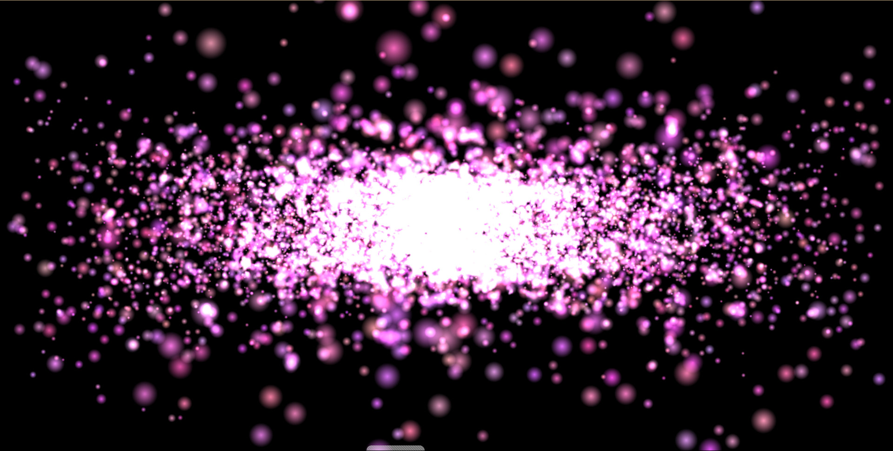
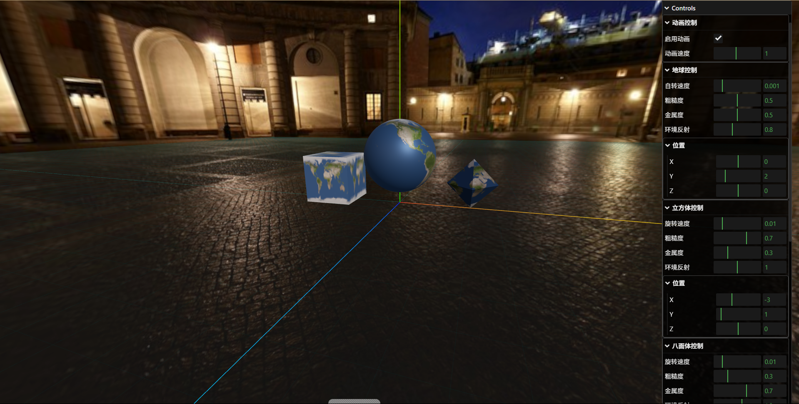
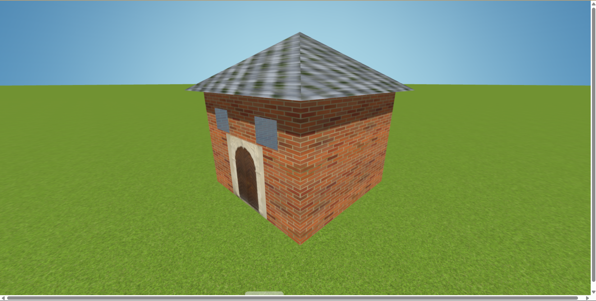
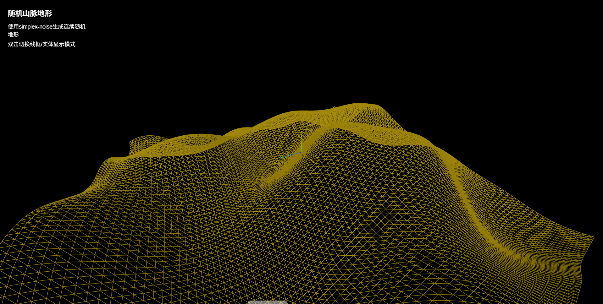
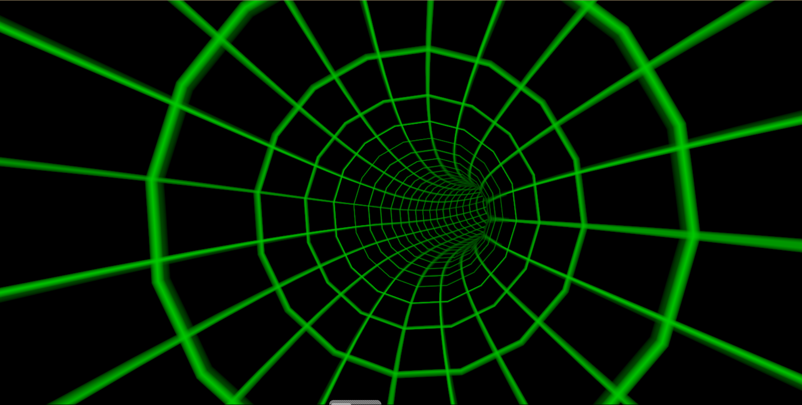
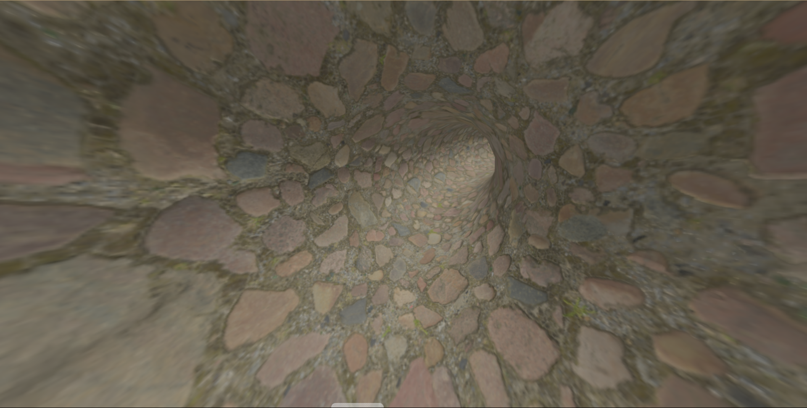

# Three.js 3D场景展示

这是一个使用 Three.js 实现的 3D 场景展示项目，包含多个独立的场景效果。

## 效果展示

### 粉色旋转星海


### 地球仪效果


### 房屋场景


### 随机地形


### 无限隧道




## 项目结构
```
project/
├── server.js          # 本地服务器
├── 地球仪.html        # 地球仪场景
├── 盖房子.html        # 房屋场景
├── 随机地形山脉.html   # 地形场景
├── 无限隧道.html      # 隧道场景
├── 粒子效果.html      # 粒子效果场景
├── 柱状图.html        # 柱状图场景
├── screenshots/      # 截图文件夹
└── assets/           # 资源文件夹
    └── models/       # 3D模型文件夹
```

## 运行说明

1. 安装依赖：
```bash
npm install
```

2. 启动本地服务器：
```bash
node server.js
```

3. 访问页面：
- 地球仪： `http://localhost:3000/地球仪.html`
- 房屋场景：`http://localhost:3000/盖房子.html`
- 地形场景：`http://localhost:3000/随机地形山脉.html`
- 隧道场景：`http://localhost:3000/无限隧道.html`
- 粒子效果：`http://localhost:3000/粒子效果.html`
- 柱状图：`http://localhost:3000/柱状图.html`

## 技术栈
- Three.js
- WebGL
- Node.js
- 原生JavaScript

## 注意事项
- 需要现代浏览器支持 WebGL
- 建议使用 Chrome 或 Firefox 最新版本
- 确保显卡驱动已更新
- 3D模型文件较大，首次加载可能需要一些时间

## 分支说明
- `master`: 当前 Three.js 版本
- `vue-version`: 原 Vue 版本代码（已存档） 